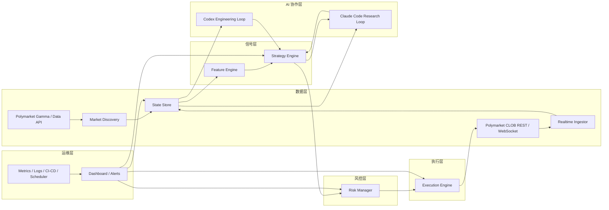

# Polymarket 实时分析与交易自动化系统方案

## 1. 项目目标

构建一套面向 Polymarket 的实时分析与交易自动化系统，目标不是“让大模型直接拍脑袋下单”，而是建立一个可审计、可扩展、可逐步放大资金规模的交易平台：

- 实时接入 Polymarket 市场、盘口、成交和账户事件
- 自动发现潜在机会市场，并输出结构化交易信号
- 将 AI 用于研究、解释、代码生成、策略迭代和复盘，而不是绕过风控直接执行
- 先实现“分析自动化 + 半自动交易”，再逐步演进到“规则约束下的自动执行”

## 2. 核心设计原则

### 2.1 AI 不直接拥有最终交易权

Claude Code 和 Codex 可以生成观点、代码、报告、测试和策略建议，但不能直接绕过执行与风控层。所有交易动作必须走规则化执行引擎。

### 2.2 事件驱动优先

系统核心应是事件流，而不是定时脚本堆叠。盘口变化、成交回报、市场新增、风控告警都应作为事件处理。

### 2.3 先数据可靠，再追求收益优化

先保证延迟、完整性、对账、重连、告警、持仓准确，再考虑多策略组合和复杂预测模型。

### 2.4 可回放、可审计、可复盘

每个信号、下单动作、风控拦截、AI 建议都要落库，便于回放和归因。

### 2.5 关键路径优先使用低延迟实现

如果系统目标只是秒级分析、告警和半自动交易，则 Python 技术栈足够高效；如果目标提升到高频监控、百毫秒级响应、快速撤单和小窗口错价捕捉，则数据采集、信号计算、风控校验和执行这条关键路径不应完全依赖 Python。

因此本方案采用以下原则：

- 研究、AI 编排、复盘、报表优先使用 Python
- 实时采集、风控前置、执行与订单状态机优先使用 Rust 或 Go
- 控制面和数据面分离，避免 dashboard、AI 任务、批处理影响交易主链路

## 3. 顶层架构设计

系统顶层采用六层架构，所有模块都应归属到以下六个层级中，避免后续开发时出现职责重叠或 AI 与交易核心耦合过深的问题。

### 3.1 数据层

职责：

- 接入 Polymarket 的市场元数据、订单簿、成交、用户订单与账户事件
- 对实时流进行清洗、标准化、缓存、持久化和回放
- 为上层信号、风控、AI 分析提供统一可信的数据底座

包含模块：

- `Market Discovery`
- `Realtime Ingestor`
- `State Store`

关键输出：

- 市场主数据
- 实时盘口流
- 成交流
- 用户订单与成交回报
- 特征计算所需的原始快照

### 3.2 信号层

职责：

- 将数据层沉淀的原始事件和快照转化为特征、因子和交易信号
- 隔离“研究判断”与“实际下单”
- 支持规则策略、统计策略和 AI 辅助研究策略并行存在

包含模块：

- `Feature Engine`
- `Strategy Engine`

关键输出：

- 实时特征快照
- 候选信号
- 信号解释引用
- 信号置信度和时效性约束

### 3.3 执行层

职责：

- 将通过审批或风控放行的信号转换为标准订单请求
- 管理下单、改单、撤单、重试、超时撤单和状态同步
- 保证执行层始终只处理结构化请求，不接收自然语言指令

包含模块：

- `Execution Engine`

关键输出：

- 订单请求
- 订单状态变更
- 成交结果
- 执行偏差数据

### 3.4 风控层

职责：

- 作为执行前和持仓中的独立约束层
- 对仓位、损失、滑点、流动性、数据延迟和连接健康度进行统一控制
- 在异常情况下执行降级、限流、只减仓或停机

包含模块：

- `Risk Manager`

关键输出：

- 风控放行
- 风控拒绝
- 熔断事件
- kill switch 状态

### 3.5 AI 协作层

职责：

- 利用 Claude Code 和 Codex 做研究、解释、复盘、代码生成、测试补齐和策略迭代
- 让 AI 服务于“认知”和“开发效率”，而不是直接替代交易核心控制逻辑
- 为人工交易员、策略研究员和工程团队提供高价值辅助

包含模块：

- `Claude Code Research Loop`
- `Codex Engineering Loop`
- `AI Orchestrator`

关键输出：

- 研究卡片
- 异常归因报告
- 每日复盘
- 代码补丁建议
- 回测和配置改进建议

### 3.6 运维层

职责：

- 保障整个系统的部署、监控、日志、告警、回滚、任务编排和权限控制
- 提供可观测性、可靠性和生产运行保障
- 支持模拟盘、灰度实盘和多阶段发布

包含模块：

- `Dashboard / Alerts`
- 监控与日志系统
- CI/CD
- 定时任务与工作流编排

关键输出：

- 系统运行指标
- 告警通知
- 发布记录
- 故障诊断信息
- 自动化任务执行记录

### 3.7 六层之间的关系

从依赖方向看，系统应遵循以下顺序：

`数据层 -> 信号层 -> 风控层 -> 执行层`

其中：

- `AI 协作层` 横向服务于数据分析、信号解释、策略改进和工程迭代
- `运维层` 横向覆盖所有层，负责可观测性、部署和运行保障

这意味着：

- 数据层不能依赖 AI 协作层才能工作
- 执行层不能直接信任 AI 输出
- 风控层必须独立于策略层和 AI 层
- 运维层必须能对所有层做监控和告警

## 4. 系统总体架构



## 5. 模块拆分

### 5.1 Market Discovery

职责：

- 从 Polymarket 市场接口获取新增市场、活跃市场、临近结算市场
- 维护 `watchlist`
- 识别市场分组、互斥市场、条件市场和高相关市场

输出：

- `market_created`
- `market_status_changed`
- `market_watchlist_updated`

建议技术：

- Python
- FastAPI + APScheduler 或 Prefect
- Postgres 持久化市场元信息

### 5.2 Realtime Ingestor

职责：

- 订阅 Polymarket CLOB WebSocket 市场频道和用户频道
- 拉取 order book、trades、best bid/ask、订单状态和成交回报
- 自动重连、去重、补拉快照

输出：

- `orderbook_tick`
- `trade_tick`
- `bbo_tick`
- `order_update`
- `fill_update`

建议技术：

- Python `asyncio`
- WebSocket client
- Redis Streams 作为 MVP 消息总线

### 5.3 Feature Engine

职责：

- 将原始流数据聚合为可交易特征
- 按 1 秒、5 秒、1 分钟等窗口持续更新
- 形成策略输入层

推荐特征：

- `mid_price`
- `spread_bps`
- `depth_imbalance`
- `trade_intensity_1m`
- `orderbook_pressure`
- `price_jump_score`
- `volume_spike_score`
- `time_to_resolution`
- `cross_market_dislocation`

输出：

- `feature_snapshot`
- `feature_alert`

### 5.4 Strategy Engine

职责：

- 消费实时特征和市场状态
- 输出标准化交易信号
- 将“策略逻辑”和“执行逻辑”解耦

首批策略建议：

- 盘口异常策略：捕捉短时价差和流动性畸变
- 相关市场错价策略：识别互斥或强相关市场的不一致定价
- 临近结算错价策略：识别时间衰减下的定价偏移
- 半自动事件驱动策略：AI 输出解释，人确认执行

信号输出必须使用统一 schema：

```json
{
  "signal_id": "sig_20260312_001",
  "market_id": "0x123",
  "strategy_id": "cross_market_dislocation_v1",
  "side": "buy_yes",
  "price": 0.43,
  "size": 250,
  "expected_edge_bps": 180,
  "confidence": 0.71,
  "ttl_seconds": 20,
  "reason_code": "spread_dislocation",
  "explanation_ref": "note_abc123"
}
```

### 5.5 Risk Manager

职责：

- 对每一笔交易请求做前置风控
- 对已持仓和挂单做盘中风险监控
- 异常时自动熔断

必须实现的风控规则：

- 单市场最大仓位
- 单事件簇最大敞口
- 单日最大亏损
- 最大允许滑点
- 最低深度门槛
- 数据延迟阈值
- 连续报错次数阈值
- WebSocket 失联熔断
- kill switch

风控决策输出：

- `risk_pass`
- `risk_reject`
- `risk_reduce_only`
- `trading_halted`

### 5.6 Execution Engine

职责：

- 接收通过风控的结构化信号
- 负责下单、改单、撤单和订单状态同步
- 处理重试、幂等、对账

关键原则：

- 只接收结构化订单请求，不接收自然语言
- 支持 `post-only`、限价单、超时撤单
- 必须做本地订单状态机

订单请求 schema：

```json
{
  "request_id": "ordreq_20260312_001",
  "market_id": "0x123",
  "side": "buy_yes",
  "limit_price": 0.43,
  "size": 250,
  "time_in_force": "gtc",
  "max_slippage_bps": 40,
  "source_signal_id": "sig_20260312_001"
}
```

### 5.7 State Store

职责：

- 存储市场、特征、信号、订单、成交、仓位、风险事件、AI 记录
- 支持回测、复盘和监控看板

推荐选型：

- Postgres：交易状态和业务表
- TimescaleDB：时间序列特征和行情快照
- Redis：实时缓存、队列、幂等键

### 5.8 Dashboard / Alerts

职责：

- 展示市场池、实时特征、信号、持仓、PnL、风险状态
- 提供人工确认入口
- 统一聚合告警

建议最先做的页面：

- 市场监控页
- 策略信号页
- 挂单与成交页
- 风控状态页
- AI 研究卡片页

## 6. AI 协作层设计

### 6.1 Claude Code 的定位

Claude Code 适合做研究代理和解释代理：

- 读取实时异常日志、市场快照、订单执行结果
- 对单个市场生成“研究卡片”
- 对异常波动给出候选原因和风险提示
- 盘后复盘策略表现和执行偏差
- 将外部文本资料整理成结构化摘要

适合 Claude Code 的任务模板：

- “分析过去 30 分钟内 spread 急剧扩大的市场，归纳共同特征”
- “对今天所有被风控拒绝的信号进行分类，找出规则过严或策略质量差的原因”
- “为 watchlist 中前 20 个市场输出研究卡片，包括市场描述、赔率结构、流动性、短期风险”

### 6.2 Codex 的定位

Codex 适合做工程代理和代码代理：

- 根据研究结论修改策略代码
- 自动补充测试
- 批量生成新市场类型的解析器
- 对 nightly 回测结果做差异分析
- 提交 PR、修复回归、优化监控脚本

适合 Codex 的任务模板：

- “为 `cross_market_dislocation_v1` 增加最大持有时长限制和对应测试”
- “扫描仓库中所有策略配置，补齐缺失的风控字段”
- “根据昨晚回测结果，列出表现退化最明显的策略并生成修复 PR”

### 6.3 推荐分工原则

- Claude Code 负责“理解”
- Codex 负责“实现”
- 执行引擎负责“行动”

## 7. 自动化工作流设计

### 7.1 工作流 A：市场雷达

目标：

- 每 5 分钟扫描活跃市场，更新 watchlist

输入：

- Gamma API 市场数据
- 最近 1 小时成交量和价差统计

输出：

- `watchlist`
- 市场分层标签：高流动、高波动、临近结算、需要人工研究

### 7.2 工作流 B：盘口异常告警

触发条件：

- `spread_bps` 超阈值
- `price_jump_score` 超阈值
- `depth_imbalance` 急剧变化

动作：

- 写入异常事件
- 触发 Claude Code 生成解释卡片
- 如满足策略条件，输出候选信号

### 7.3 工作流 C：半自动交易

触发条件：

- 策略信号置信度高于阈值
- 风控预检查通过
- 市场在人工关注列表中

动作：

- 生成下单建议
- 在 dashboard 上展示“策略理由 + 风险摘要 + 建议价格区间”
- 人工点击确认后进入执行引擎

### 7.4 工作流 D：全自动微额执行

前提：

- 策略至少完成一轮历史回放
- 连续多日模拟盘通过
- 风控事件频率在可接受范围内

动作：

- 对指定策略和指定市场子集开放小额自动执行
- 强制设置更严格的仓位和损失限制

### 7.5 工作流 E：每日复盘

每天固定时间运行：

- 汇总当日信号数、成交率、胜率、PnL、滑点、风控拒绝率
- 让 Claude Code 生成复盘摘要
- 让 Codex 读取复盘结果并提出代码级改进建议

## 8. 建议的数据表设计

### 8.1 `markets`

- `market_id`
- `slug`
- `question`
- `category`
- `status`
- `end_time`
- `liquidity_score`
- `created_at`
- `updated_at`

### 8.2 `orderbook_features`

- `id`
- `market_id`
- `ts`
- `mid_price`
- `spread_bps`
- `depth_bid`
- `depth_ask`
- `depth_imbalance`
- `trade_intensity_1m`
- `price_jump_score`

### 8.3 `signals`

- `signal_id`
- `strategy_id`
- `market_id`
- `ts`
- `side`
- `price`
- `size`
- `confidence`
- `expected_edge_bps`
- `status`
- `reason_code`

### 8.4 `orders`

- `order_id`
- `request_id`
- `market_id`
- `signal_id`
- `side`
- `limit_price`
- `size`
- `filled_size`
- `status`
- `exchange_order_id`
- `created_at`
- `updated_at`

### 8.5 `positions`

- `position_id`
- `market_id`
- `net_qty`
- `avg_price`
- `unrealized_pnl`
- `realized_pnl`
- `updated_at`

### 8.6 `risk_events`

- `risk_event_id`
- `ts`
- `market_id`
- `severity`
- `rule_name`
- `decision`
- `details_json`

### 8.7 `ai_research_notes`

- `note_id`
- `ts`
- `market_id`
- `source_type`
- `summary`
- `confidence`
- `raw_ref`

## 9. 服务间接口建议

### 9.1 事件总线 topic

- `markets.discovered`
- `marketdata.orderbook`
- `marketdata.trades`
- `features.snapshots`
- `signals.generated`
- `risk.decisions`
- `orders.requests`
- `orders.updates`
- `risk.alerts`
- `ai.notes`

### 9.2 内部 API

- `GET /markets/watchlist`
- `GET /markets/{market_id}/snapshot`
- `GET /signals/recent`
- `POST /signals/{signal_id}/approve`
- `POST /orders`
- `POST /risk/kill-switch`
- `GET /positions`
- `GET /pnl/daily`

## 10. 推荐的项目目录结构

```text
polybob/
  apps/
    api/
    dashboard/
    worker/
  services/
    market_discovery/
    realtime_ingestor/
    feature_engine/
    strategy_engine/
    risk_manager/
    execution_engine/
    ai_orchestrator/
  strategies/
    cross_market_dislocation_v1/
    spread_reversion_v1/
    resolution_decay_v1/
  libs/
    polymarket/
    events/
    db/
    risk/
    metrics/
    schemas/
  infra/
    docker/
    k8s/
    terraform/
  docs/
    polymarket-realtime-ai-trading-system.md
```

## 11. 推荐技术栈

### 11.1 先给结论

原始建议中的技术栈适合以下场景：

- 秒级到数百毫秒级的实时分析
- 半自动交易
- 小规模自动执行
- 快速验证策略和 AI 协作流程

但如果你的目标是“实时性要求很大”，尤其是以下情况：

- 需要尽快响应盘口跳变
- 需要快速撤单与重挂
- 需要更高吞吐和更稳定的状态机
- 需要尽量减少 Python GC、解释器和单进程事件循环带来的抖动

那么建议把技术栈调整为“关键路径低延迟 + 非关键路径高研发效率”的混合架构。

### 11.2 分层技术建议

#### 数据层

推荐：

- `Rust` 或 `Go` 用于 `Realtime Ingestor`
- Python 可保留给 `Market Discovery`
- Postgres + TimescaleDB 做持久化
- Redis 只做缓存、幂等键和轻量状态

原因：

- `Market Discovery` 偏 IO 和批量拉取，Python 足够
- `Realtime Ingestor` 需要长连接、重连、去重、快照同步和高频消息消费，更适合 Rust 或 Go

结论：

- 数据层不要全用 Python
- 实时入口建议首选 Rust，次选 Go

#### 信号层

推荐：

- 低延迟特征计算使用 `Rust`
- 策略研究、离线特征实验、回测分析使用 `Python`

原因：

- 简单 rolling features 在 Python 中做原型很快
- 但生产中的高频窗口聚合、盘口特征更新和跨市场联动计算，如果市场数增多，Rust 更稳

结论：

- 生产信号链路建议采用“双实现”模式
- Python 先验证，成熟后迁移关键策略到 Rust

#### 风控层

推荐：

- `Rust` 独立服务

原因：

- 风控必须是交易主链路里最稳定、最可预测的一环
- 它不能和 AI、报表、Web API、后台脚本共享资源或进程

结论：

- 风控层不建议用 Python 作为最终生产实现

#### 执行层

推荐：

- `Rust` 作为首选

原因：

- 执行层要维护订单状态机、撤改单、重试和幂等
- 它是最怕长尾延迟和状态漂移的模块

结论：

- 执行层建议直接用 Rust 起步，不建议后期再整体迁移

#### AI 协作层

推荐：

- Python
- LangGraph 或自定义 agent orchestrator
- Claude Code + Codex

原因：

- 这一层重点是集成、推理、读写仓库、调用工具，不是极致低延迟

结论：

- AI 层继续用 Python 是合适的

#### 运维层

推荐：

- Docker Compose 用于本地开发
- Kubernetes 用于生产
- Prometheus + Grafana + Loki + Sentry

原因：

- 这套组合成熟，且适合实时系统的指标、日志和异常追踪

### 11.3 消息总线怎么选

原方案里写 `Redis Streams 作为 MVP 消息总线`，这个判断对 MVP 是对的，但如果你的实时性要求明显提高，我会做如下调整：

#### 方案 A：MVP

- Redis Streams

适合：

- 单机或小规模部署
- 快速起系统
- 事件量还不大
- 更关心研发速度而不是极致延迟与可回放能力

#### 方案 B：生产实时系统

- `NATS` 或 `NATS JetStream`

适合：

- 低延迟事件分发
- 服务之间需要轻量 pub/sub
- 希望比 Kafka 更轻、更易运维

#### 方案 C：大吞吐与强回放

- `Kafka` 或兼容 Kafka API 的 `Redpanda`

适合：

- 市场数很多
- 需要长期保留事件流
- 要做大量回放、重放、审计和下游分析

我的建议：

- Phase 1 用 Redis Streams
- 当你进入“多策略 + 多市场 + 小额自动执行”阶段时，迁移到 NATS
- 如果后续重点转向大规模历史回放和数据平台建设，再考虑 Kafka/Redpanda

### 11.4 API 服务怎么选

原方案里的 `FastAPI` 适合作为控制面 API，但不适合作为所有高实时服务的统一承载。

建议拆分为：

- 控制面 API：FastAPI
- 实时服务：Rust/Go 常驻进程
- dashboard 后端：Node.js 或 FastAPI 均可

不要把以下职责都塞进同一个 FastAPI 进程：

- WebSocket 行情消费
- 特征计算
- 风控决策
- 下单执行
- dashboard API
- AI 后台任务

### 11.5 数据库怎么选

原方案里的 `Postgres + TimescaleDB + Redis` 是合理的，但要注意用途边界：

- Postgres：订单、成交、持仓、风控事件、配置
- TimescaleDB：时间序列特征、行情快照、聚合结果
- Redis：缓存、速查状态、幂等控制、轻量队列

不建议：

- 用 Redis 作为唯一事件存储
- 用 Postgres 直接承接所有高频原始消息

更稳的做法是：

- 原始流先进消息总线
- 关键状态写 Postgres
- 聚合后特征写 TimescaleDB

### 11.6 前端与 dashboard

`Next.js` 本身没有问题，但它应属于控制面，不应阻塞交易链路。

建议：

- 前端只读聚合后的状态
- 所有交易动作通过独立权限 API
- 人工确认下单也不要直接操作执行服务内部状态

### 11.7 推荐的生产级组合

如果你要的是“强实时但不是交易所撮合级超低延迟”，我推荐下面这套更平衡的组合：

- 数据层：Rust + Postgres + TimescaleDB + Redis
- 信号层：Rust 生产计算 + Python 研究验证
- 风控层：Rust
- 执行层：Rust
- AI 协作层：Python + Claude Code + Codex
- 运维层：Kubernetes + Prometheus + Grafana + Loki + Sentry
- 消息总线：MVP 用 Redis Streams，生产升级到 NATS JetStream

### 11.8 延迟目标建议

建议把实时性要求先定义成目标，而不是笼统追求“越快越好”：

- `1-5 秒`：分析、告警、AI 研究，Python 足够
- `100-500 ms`：半自动交易与多数策略自动执行，混合栈合适
- `<100 ms`：关键路径建议全部使用 Rust，并严格隔离控制面

如果未来目标是更低延迟，还需要进一步考虑：

- 机房区域与网络路径
- 并发模型
- 内存分配与序列化成本
- 限价单和撤单策略的撮合适配
- 系统级 profiling

### 11.9 核心实现建议摘要

后端与服务：

- 控制面 API：Python + FastAPI
- 实时采集：Rust
- 生产特征计算：Rust
- 风控：Rust
- 执行：Rust
- AI 编排：Python

基础设施：

- Postgres + TimescaleDB
- Redis
- NATS JetStream
- Docker Compose for dev
- Kubernetes for production

观测性：

- Prometheus
- Grafana
- Loki
- Sentry
- OpenTelemetry

前端：

- Next.js
- Tailwind CSS
- Recharts 或 ECharts

AI 编排：

- Claude Code：研究与解释
- Codex：代码生成与维护
- MCP 或内部 tool adapter：把数据库、日志、回测结果暴露给 AI

## 12. 数据一致性和状态同步方案

### 12.1 一致性设计目标

本系统是“外部交易所状态 + 本地事件流 + 多服务投影”的系统，因此一致性目标要分层定义：

- 订单、成交、持仓最终必须与交易所一致
- 风控决策必须基于足够新鲜且可验证的数据
- 任何服务重启后都能从事件流和持久化状态中恢复
- AI、看板、报表允许最终一致，但执行和风控必须保持近实时一致

建议采用：

- 执行链路：强约束、低延迟、可恢复
- 分析链路：最终一致、可回放

### 12.2 状态分类与权威源

必须先定义每类状态的权威源。

#### 参考状态

包括：

- 市场元数据
- 策略配置
- 风控配置
- 市场分组与标签

权威源：

- Polymarket API
- Git 管理的配置
- Postgres

#### 市场状态

包括：

- order book
- best bid/ask
- recent trades
- 聚合特征

权威源：

- Polymarket market WebSocket 为主
- REST/snapshot 校验与修复为辅

#### 交易状态

包括：

- 本地下单意图
- 订单状态机
- 成交明细
- 持仓
- PnL

权威源：

- 本地 `order_intent` 账本负责“我打算做什么”
- Polymarket user WebSocket 负责“交易所确认了什么”
- 定时账户与订单对账接口负责“修复差异”

### 12.3 标准事件封装

所有输入都必须统一成标准事件，以便去重、回放和审计。

```json
{
  "event_id": "evt_01JXYZ",
  "event_type": "orders.updated",
  "source": "polymarket_user_ws",
  "source_key": "exchange_order_id_or_hash",
  "source_ts": "2026-03-12T10:00:00.123Z",
  "ingest_ts": "2026-03-12T10:00:00.141Z",
  "process_ts": "2026-03-12T10:00:00.148Z",
  "trace_id": "tr_abc123",
  "entity_type": "order",
  "entity_id": "ord_123",
  "version": 17,
  "payload": {}
}
```

规则：

- 每个事件必须有全局唯一 `event_id`
- 每个业务实体必须有单调递增的 `version`
- 所有链路都保留 `source_ts`、`ingest_ts`、`process_ts`
- 去重优先使用 `source_key + version`

### 12.4 市场数据同步方案

市场数据采用“流优先 + 快照修复”的双轨模式：

1. `Realtime Ingestor` 常驻订阅 Polymarket market WebSocket。
2. 原始消息先进入消息总线，再做标准化。
3. `Feature Engine` 只消费标准化事件，不直接访问交易所。
4. 定时拉取 snapshot，对关键市场做校正。
5. 出现以下情况时触发市场状态重建：

- 消息流中断
- 心跳超时
- 本地 order book 非法
- 特征发现价格跳变不合理

最佳实践：

- order book 使用可重建数据结构
- 每次快照重建生成新的 `snapshot_epoch`
- 所有特征结果都记录来源 epoch

### 12.5 订单状态同步方案

订单状态必须采用“写前日志 + 本地状态机 + 外部确认 + 周期对账”的四段式设计。

#### 写前日志

执行层收到通过风控的订单请求后，先写入本地 `order_intent`：

- `request_id`
- `strategy_id`
- `market_id`
- `desired_side`
- `desired_price`
- `desired_size`
- `risk_approval_id`
- `status = pending_send`

只有写入成功后才允许真正发单。

#### 本地状态机

建议状态：

- `pending_send`
- `sent`
- `acknowledged`
- `partially_filled`
- `filled`
- `cancel_pending`
- `cancelled`
- `rejected`
- `expired`
- `reconcile_required`

状态迁移必须是单向可审计的。

#### 外部确认

优先消费用户事件流更新本地状态：

- 下单确认
- 部分成交
- 全部成交
- 撤单确认
- 订单拒绝

原则：

- 本地发送成功不代表交易所已接收
- 交易所已接收不代表已成交
- 未收到确认时不能假设订单不存在

#### 周期对账

每隔数秒执行一次：

- 查询 open orders
- 查询最近 fills
- 查询账户持仓
- 生成修复事件

以下情况必须进入 `reconcile_required`：

- 超时未确认
- 本地已撤但交易所仍 open
- 持仓与累计成交不一致

### 12.6 持仓与 PnL 同步方案

持仓不能直接靠“最新查询结果覆盖写入”，应采用事件投影：

- fills 驱动更新 `positions`
- 定时账户查询做总量校验
- 差异进入 `position_reconcile_queue`

PnL 建议分三层：

- `execution_pnl`
- `mark_to_market_pnl`
- `realized_pnl`

风控默认以更保守的一层为准：

- 有持仓时用 `mark_to_market_pnl`
- 流动性异常或临近结算时用保守估值

### 12.7 一致性检查与故障处置

必须实现以下检查器：

- `ws_liveness_checker`
- `snapshot_drift_checker`
- `order_reconcile_checker`
- `position_reconcile_checker`
- `clock_skew_checker`

故障处置策略：

- 市场数据陈旧：停止新开仓，只允许减仓
- 用户流断开：暂停执行层，对账完成前不恢复
- 订单状态不明：禁止重复发单，转入人工确认或自动对账
- 时钟偏移过大：直接触发告警

## 13. 回测框架设计

### 13.1 设计原则

回测框架应尽量复用线上相同的特征、信号、风控和执行接口，而不是做一套脱离生产的“研究版策略代码”。

核心原则：

- 同一套策略逻辑同时服务在线和离线
- 回测输入优先使用录制的标准事件流
- 回测必须包含延迟、滑点、撤单失败和部分成交
- 风控规则必须在回测中真实生效

### 13.2 四层结构

#### 数据回放层

输入：

- 录制的 market WebSocket 事件
- 用户订单与成交事件
- 市场元数据快照

职责：

- 按时间顺序回放标准事件
- 支持加速、减速和逐事件推进
- 支持单市场和多市场组合回放

#### 特征与信号层

职责：

- 直接复用线上 `Feature Engine` 和 `Strategy Engine` 代码
- 支持不同参数和不同策略版本的对比

#### 执行模拟层

职责：

- 模拟下单、排队、成交、部分成交和撤单
- 注入网络延迟、风控延迟和执行延迟

#### 评估层

输出：

- PnL
- 最大回撤
- 滑点损失
- 风控拒绝率
- 平均持有时长
- 策略容量估计

### 13.3 回测数据模型

建议保存：

- `raw_events`
- `market_snapshots`
- `features_replayed`
- `signals_replayed`
- `orders_simulated`
- `fills_simulated`
- `risk_decisions_replayed`
- `backtest_runs`

每次回测必须记录：

- 策略版本
- 参数版本
- 数据区间
- 数据完整性等级
- 延迟设定
- 滑点模型版本

### 13.4 成交模拟的最优做法

如果拿不到完整逐笔排队信息，不要假装能精确还原真实成交顺序。更稳妥的方式是构建三档模型：

#### Model A：保守成交模型

- 只在价格明显穿透时成交
- 对挂单成交概率打折

#### Model B：中性成交模型

- 基于 best bid/ask、成交方向和短窗口成交量估计成交概率

#### Model C：乐观成交模型

- 假设挂单更容易成交
- 只用于估计上界

上线前应以保守模型和中性模型为准。

### 13.5 回测与实盘一致性验证

需要建立 `backtest_vs_live` 对比机制：

- 同一策略在模拟盘和小额实盘同时运行
- 比较信号一致率
- 比较风控拒绝率
- 比较平均成交偏差
- 比较 PnL 偏移

以下任一指标连续异常，则禁止扩大自动化规模：

- 信号一致率低于阈值
- 平均成交偏差过大
- 风控决策与线上不一致
- 实盘回撤明显超出回测区间

## 14. 延迟监控和 SLA 定义

### 14.1 关键时间戳

所有关键链路都要记录以下时间戳：

- `source_ts`
- `ingest_ts`
- `normalize_ts`
- `feature_ts`
- `signal_ts`
- `risk_ts`
- `send_ts`
- `ack_ts`
- `fill_ts`

同时要求：

- 生产节点统一 NTP/Chrony
- 时钟偏移超阈值直接告警

### 14.2 关键延迟指标

至少监控：

- 市场数据接入延迟：`ingest_ts - source_ts`
- 标准化延迟：`normalize_ts - ingest_ts`
- 特征计算延迟：`feature_ts - normalize_ts`
- 信号生成延迟：`signal_ts - feature_ts`
- 风控延迟：`risk_ts - signal_ts`
- 下单发送延迟：`send_ts - risk_ts`
- 订单确认往返时间：`ack_ts - send_ts`
- 成交确认时间：`fill_ts - send_ts`
- 总决策链路延迟：`send_ts - source_ts`

### 14.3 分层 SLA/SLO 建议

下面的数字适合作为生产起点：

#### 数据层

- 市场数据接入延迟 `p95 < 120ms`
- 市场数据接入延迟 `p99 < 250ms`
- WebSocket 可用性 `>= 99.9%`
- 关键市场数据陈旧时间不超过 `500ms`

#### 信号层

- 特征计算延迟 `p95 < 30ms`
- 单策略信号生成延迟 `p95 < 20ms`
- 信号丢失率 `< 0.1%`

#### 风控层

- 风控决策延迟 `p95 < 10ms`
- 风控服务可用性 `>= 99.95%`

#### 执行层

- 发单路径内部延迟 `p95 < 15ms`
- 订单确认往返时间 `p95 < 150ms`
- 撤单确认时间 `p95 < 180ms`

#### AI 协作层

- 不纳入交易主 SLA
- 研究和复盘允许秒级到分钟级延迟

### 14.4 SLA 触发后的降级策略

建议建立三级响应：

#### Level 1：告警

- p95 超阈值但未持续

#### Level 2：限制新开仓

- 数据陈旧持续
- 风控延迟持续超阈值
- 订单确认显著变慢

动作：

- 停止新开仓
- 保留撤单和减仓

#### Level 3：交易熔断

- 用户流断开
- 核心服务不可用
- 时钟漂移严重
- 对账异常累计超阈值

动作：

- 全部策略暂停
- 撤销高风险挂单
- 要求人工确认恢复

### 14.5 可观测性实现建议

必须建立：

- Prometheus 指标
- 分布式 tracing
- 实体级结构化日志
- 延迟热图和分位图

关键 dashboard 至少包括：

- 交易主链路延迟面板
- WebSocket 健康面板
- 订单状态机面板
- 策略吞吐与拒绝率面板
- 服务重启与错误率面板

## 15. 资金管理和仓位控制

### 15.1 资金分层

建议把资金划分为四层预算：

- `global_capital`
- `active_risk_capital`
- `strategy_budget`
- `market_cluster_budget`

其中：

- `active_risk_capital` 不应等于账户总资金
- 上线初期只开放总资金中的小比例

### 15.2 单笔仓位 sizing 原则

不建议固定每笔金额，也不建议直接使用理论 Kelly。更稳妥的做法是“折扣后的分层 sizing”：

```text
target_size =
min(
  size_by_edge_confidence,
  size_by_market_liquidity,
  size_by_strategy_budget,
  size_by_cluster_budget,
  size_by_global_drawdown_guard
)
```

其中：

- `size_by_edge_confidence`：根据信号 edge 和校准后置信度决定
- `size_by_market_liquidity`：根据盘口深度和允许滑点决定
- `size_by_strategy_budget`：限制单策略扩张
- `size_by_cluster_budget`：限制相关市场集中暴露
- `size_by_global_drawdown_guard`：系统回撤扩大时自动收缩

### 15.3 推荐的 sizing 方法

建议使用“折扣版 fractional Kelly + 流动性上限”：

1. 先估计信号 edge。
2. 对模型置信度做校准折扣。
3. 只取理论 Kelly 的小比例，例如 `0.1x - 0.25x`。
4. 再叠加流动性和预算上限。

如果模型尚未稳定，先使用固定风险单位更安全。

### 15.4 流动性约束

预测市场里，流动性约束通常比理论 edge 更重要。建议至少限制：

- 单笔下单量不能超过可见盘口深度的一定比例
- 预期滑点超过阈值则拒绝开仓
- 低流动市场只允许人工确认或极小仓位

更保守的经验规则：

- 单笔下单不超过目标价位附近可见深度的 `10%-20%`
- 同一市场净仓位不超过该市场日成交量的一定比例

### 15.5 相关性与事件簇控制

Polymarket 中很多市场并非独立，必须按“事件簇”控制风险：

- 同一主题下多个市场高度相关
- 条件市场和主市场可能重复暴露
- 互斥市场可能形成隐藏杠杆

建议为每个信号打上：

- `strategy_id`
- `market_cluster_id`
- `theme_id`
- `correlation_bucket`

然后按桶控制总敞口，而不是只看单市场仓位。

### 15.6 回撤与停机规则

建议同时定义：

- 单策略日内最大亏损
- 单策略滚动周最大亏损
- 全局日内最大亏损
- 全局最大回撤

触发后动作：

- 一级：自动降低新仓 sizing
- 二级：停止该策略开仓
- 三级：全局只减仓

### 15.7 结算与尾部风险

预测市场还要特别处理结算风险：

- 临近结算前流动性可能失真
- 市场暂停或争议会拉长资金占用
- 高相关事件可能集中结算

因此应单独定义：

- `resolution_risk_limit`
- `pending_resolution_capital_limit`

## 16. 灾难恢复和高可用设计

### 16.1 设计原则

高可用的关键不是所有服务都做多副本，而是避免执行层双活和状态分裂。

原则：

- 数据采集可以多实例
- dashboard 和 AI 可以横向扩展
- 风控和执行必须单 active
- 故障切换必须依赖租约或领导者选举

### 16.2 推荐架构

#### 执行层与风控层

- 单 active + 单 warm standby
- 通过 Postgres advisory lock、etcd 或 Consul lease 做 leader election
- 只有持有租约的实例允许发单

#### 数据层

- WebSocket 消费器可多实例分片
- 消息总线采用持久化部署
- Postgres 主从复制
- TimescaleDB 做定期备份

#### 运维层

- Kubernetes 多节点部署
- 关键服务设置 anti-affinity
- Secret 独立管理

### 16.3 故障切换流程

建议流程：

1. active 执行实例失联。
2. standby 检测租约过期。
3. standby 先进入 `reconcile_only`。
4. 拉取 open orders、fills、positions，与本地账本对齐。
5. 对账完成后才允许进入 `active_trading`。

这个流程能避免在未知状态下重复发单。

### 16.4 备份与恢复

必须备份：

- Postgres 全量与 WAL
- 策略配置
- 风控配置
- AI prompt 模板和任务定义
- 回测结果元数据

建议：

- Postgres 支持点时间恢复
- 配置和策略代码进入 Git
- 每日导出关键订单与成交审计表

### 16.5 灾难恢复目标

建议初始目标：

- `RPO <= 1 min`
- `RTO <= 10 min`

对于交易主链路：

- 恢复后必须先对账再恢复交易
- 在无法确保状态正确前，只允许撤单和减仓

### 16.6 演练机制

至少每月做一次演练：

- 模拟 WebSocket 中断
- 模拟执行层主实例宕机
- 模拟数据库主从切换
- 模拟时钟漂移
- 模拟消息堆积

演练后输出：

- 问题清单
- 恢复耗时
- 是否满足 RPO/RTO
- 待补自动化脚本

## 17. AI 协作层的具体实现

### 17.1 总体定位

AI 协作层不是直接控制交易系统的“大脑”，而是受约束的辅助层，主要承担：

- 研究分析
- 异常解释
- 复盘总结
- 代码生成和测试补齐
- 参数建议和实验编排

### 17.2 组件拆分

建议拆成四个组件：

#### `ai-orchestrator`

职责：

- 接收 AI 任务请求
- 路由到 Claude Code 或 Codex
- 管理任务状态、上下文、权限和产物

#### `research-runner`

职责：

- 调用 Claude Code
- 读取市场快照、日志、异常事件和复盘数据
- 生成研究卡片和解释报告

#### `engineering-runner`

职责：

- 调用 Codex
- 在受控仓库上下文中修改代码、补测试、生成 PR

#### `memory-store`

职责：

- 存储 AI 任务输入、输出、评分、反馈和模板
- 形成可检索的研究与工程记忆

### 17.3 AI 任务类型

建议标准化成以下任务：

- `market_research`
- `anomaly_explainer`
- `daily_review`
- `strategy_diff_review`
- `risk_rule_audit`
- `code_patch_generation`
- `test_gap_fill`

每个任务都要定义：

- 输入 schema
- 输出 schema
- 允许使用的工具
- 最大执行时长
- 是否需要人工审批

### 17.4 Claude Code 的具体职责

Claude Code 负责“理解型任务”：

- 盘中异常解释
- 市场研究卡片生成
- 当日交易复盘
- 风控拦截案例归类
- 外部文本资料提炼

输出必须结构化，例如：

```json
{
  "task_type": "market_research",
  "market_id": "0x123",
  "summary": "short summary",
  "hypotheses": [
    "possible driver 1",
    "possible driver 2"
  ],
  "risk_flags": [
    "thin liquidity",
    "resolution proximity"
  ],
  "confidence": 0.62,
  "recommended_action": "observe_only"
}
```

### 17.5 Codex 的具体职责

Codex 负责“实现型任务”：

- 根据研究结论修改策略代码
- 生成或修复测试
- 更新配置 schema
- 审查 nightly 回测退化
- 自动生成变更说明

Codex 的输出不是直接部署，而是：

- patch
- PR
- 测试结果
- 风险说明

### 17.6 AI 的工具接入

AI 只应访问受控数据接口，不应直接读取交易核心内存状态。建议提供：

- 只读市场快照查询
- 只读订单与成交查询
- 风控事件查询
- 回测结果查询
- 日志检索
- 配置与策略文件读取

边界：

- Codex 可以修改仓库代码并运行测试
- Codex 不持有生产交易密钥
- Claude Code 默认只读
- Claude Code 不直接触发下单

### 17.7 提示词和上下文工程

建议每类任务都使用模板化 prompt，并严格限制上下文：

- 只注入必要市场和时间窗口
- 明确输出 schema
- 明确禁止越权建议
- 对不确定结论要求给出置信度和证据不足点

不要把全量数据库或全量日志直接塞给 AI，而应先做：

- 聚合
- 筛选
- 摘要
- 去噪

### 17.8 AI 结果评估

AI 层需要持续评估：

- 研究卡片是否被人工采纳
- 异常解释是否与后验结果一致
- Codex 生成补丁的测试通过率
- Codex 生成补丁的回滚率
- AI 建议对收益或稳定性的实际影响

建议建立：

- `ai_task_runs`
- `ai_task_feedback`
- `ai_patch_outcomes`

### 17.9 AI 安全边界

必须明确：

- AI 无权直接调用执行 API
- AI 无权修改生产风控阈值
- AI 不能在没有审批的情况下合并策略变更
- AI 输出默认是建议，不是事实

以下任务必须人工审批：

- 放宽风控规则
- 启用新策略
- 提高仓位上限
- 修改生产执行逻辑

### 17.10 最优落地方式

建议按以下顺序落地：

1. 先做 Claude Code 的研究卡片和复盘。
2. 再做 Codex 的 nightly 测试修复和 patch 建议。
3. 再做回测结果到代码修改的半自动闭环。
4. 最后才做复杂的多 agent 编排。

## 18. 分阶段落地路径

### Phase 1: 数据底座与看板（1-2 周）

交付：

- 市场发现服务
- 实时行情采集
- 市场监控页
- 基础数据库表
- 告警链路

目标：

- 不下单，只做实时分析和记录

### Phase 2: 策略与半自动交易（2-4 周）

交付：

- 特征引擎
- 1 到 2 个基础策略
- 风控引擎 MVP
- 人工确认下单流程
- Claude Code 复盘工作流

目标：

- 小资金、半自动、强风控

### Phase 3: 自动执行与策略迭代（4-8 周）

交付：

- 自动执行引擎
- 策略回放
- Codex nightly 工程自动化
- 多策略管理
- 资金分配规则

目标：

- 指定市场子集的小额自动化

### Phase 4: 扩展与优化

交付：

- 更多市场关系建模
- 回测框架完善
- AI 驱动研究模板库
- 更细粒度的执行优化

## 19. 风险与边界

### 19.1 市场风险

- 事件结果本身存在高不确定性
- 流动性不足时滑点可能远大于预期
- 临近结算前盘口可能剧烈失真

### 19.2 工程风险

- WebSocket 断连导致状态漂移
- 本地订单状态机与交易所状态不一致
- 事件重复消费或漏消费

### 19.3 AI 风险

- AI 解释看起来合理，但不等于可交易
- AI 可能过度自信或将噪声总结为规律
- AI 输出必须被结构化约束和规则校验

## 20. 最小可行版本建议

如果要快速启动，建议先只做以下最小闭环：

1. 接通 Polymarket 市场和盘口数据
2. 实时计算 `spread_bps`、`mid_price`、`depth_imbalance`
3. 做一个 watchlist 页面
4. 做一个异常告警页面
5. Claude Code 自动生成异常分析卡片
6. 人工确认后才允许下单

这样可以先用很小成本验证三件事：

- 数据链路是否稳定
- 你是否真的能发现有价值的机会
- AI 是否对研究和复盘有实际帮助

## 21. 下一步建议

建议按下面顺序推进：

1. 先创建项目骨架、基础依赖和本地开发环境
2. 优先接入 Polymarket 市场发现和 WebSocket
3. 搭建数据库 schema 与 dashboard
4. 再接 Claude Code / Codex 的自动化工作流
5. 最后再开放交易执行能力

如果继续开发，本项目下一份文档应当补充：

- API 详细接口定义
- 事件 schema 文档
- 风控规则清单
- Phase 1 的任务拆解和验收标准
